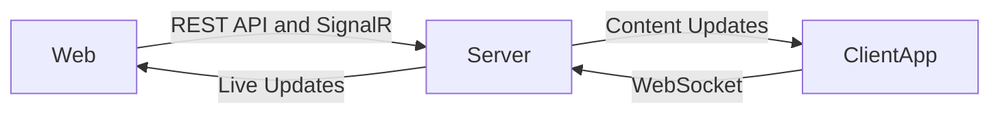

# Mireya

A versatile digital signage solution for creating and managing visual content across multiple screens in real time.

> **Disclaimer:** This project is currently in a concept state. Features, architecture, and implementation are subject to change, and it is not yet production-ready.

## Overview



## Architecture

- **Server (.NET Core):**  
  The backend is developed with .NET Core, responsible for managing screens, user authentication, and content distribution. It exposes a REST API for standard operations and uses SignalR for real-time updates and communication.

- **Web Frontend (Razor Pages):**  
  The admin interface, built with ASP.NET Core Razor Pages, allows administrators to configure screens, manage assets, and monitor the system. It uses cookie-based authentication with ASP.NET Core Identity for seamless integration with the backend.
  
  > **Note:** The Next.js web frontend (`Mireya.Web`) is deprecated and will be removed in a future release. New admin features are being implemented in Razor Pages within the `Mireya.Api` project.

- **Client Application (Android TV):**  
  The client app runs on Android TV devices, connecting to the server using WebSocket for efficient, real-time content delivery and screen updates.

This architecture ensures seamless management and instant synchronization of visual content across multiple screens.

# Development

## Mireya Api

### Database Providers

- **SQLite**: Used for quick local development
- **PostgreSQL**: Used for production and testing environments

### Migrations

```bash
# Add Migration for SQLite (Development)
dotnet ef migrations add <MigrationName> --project .\src\Mireya.Database.Sqlite --startup-project .\src\Mireya.Api -- --provider Sqlite

# Add Migration for PostgreSQL (Production/Testing)
dotnet ef migrations add <MigrationName> --project .\src\Mireya.Database.Postgres --startup-project .\src\Mireya.Api -- --provider Postgres

# Apply migrations
dotnet ef database update --project .\src\Mireya.Database.Sqlite --startup-project .\src\Mireya.Api -- --provider Sqlite
dotnet ef database update --project .\src\Mireya.Database.Postgres --startup-project .\src\Mireya.Api -- --provider Postgres
```

## Mireya Admin (Razor Pages)

The admin interface is integrated directly into the Mireya.Api project using ASP.NET Core Razor Pages with Tailwind CSS.

### Access the Admin Interface

1. Start the API server:
   ```bash
   cd src/Mireya.Api
   dotnet run
   ```

2. Navigate to the admin interface:
   ```
   https://localhost:5001/Admin/Login
   ```

3. Default admin credentials:
   - Email: `admin@mireya.local`
   - Password: (set via environment variables or user secrets)

### Admin Features

- **Dashboard**: Overview of system status, screens, and assets
- **Screen Management**: 
  - View all registered displays
  - Approve/reject new screen registrations
  - Edit screen details and settings
  - Monitor screen status and last seen time
- **Asset Management**:
  - Upload images and videos
  - View asset gallery with previews
  - Delete assets
  - Filter by asset type

### Development

The admin interface uses:
- **ASP.NET Core Razor Pages** for server-side rendering
- **Tailwind CSS** (via CDN) for styling
- **Cookie-based authentication** with ASP.NET Core Identity
- **Role-based authorization** (Admin role required)

All admin pages are located in: `src/Mireya.Api/Areas/Admin/Pages/`

## Mireya Web (Deprecated)

> **⚠️ Deprecated**: This Next.js frontend is being phased out in favor of Razor Pages. It will be removed in a future release.

### Api Generation

The NSwag tool is installed as a local dotnet tool in the repository. The configuration is defined in:

- `.config/dotnet-tools.json` - Defines the NSwag CLI tool
- `nswag.json` - Configuration for generating the TypeScript client

To regenerate the TypeScript API client after making changes to the API:

```bash
npm run generate:api
```

Or directly with dotnet:

```bash
dotnet nswag run nswag.json
```

This will:

1. Analyze the API project (`../Mireya.Api/Mireya.Api.csproj`)
2. Extract the OpenAPI/Swagger specification (document name "v1")
3. Generate TypeScript client classes in `src/lib/api/generated/client.ts`

#### Generated Files

- **`src/lib/api/generated/client.ts`** - Auto-generated TypeScript API client
  - Contains type-safe client classes for all API endpoints
  - Includes TypeScript interfaces for request/response DTOs
  - Extends `ClientBase` from `src/lib/api/client-base.ts`
