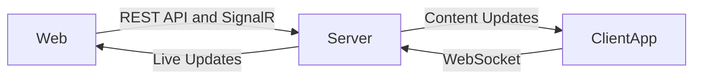

# Mireya
A versatile digital signage solution for creating and managing visual content across multiple screens in real time.

## Overview



## Architecture

- **Server (.NET Core):**  
	The backend is developed with .NET Core, responsible for managing screens, user authentication, and content distribution. It exposes a REST API for standard operations and uses SignalR for real-time updates and communication.

- **Web Frontend (Next.js):**  
	The web interface, built with Next.js, allows users to configure screens, design templates, and schedule content. It interacts with the .NET backend via REST APIs and receives live updates through SignalR.

- **Client Application (Android TV):**  
	The client app runs on Android TV devices, connecting to the server using WebSocket for efficient, real-time content delivery and screen updates.

This architecture ensures seamless management and instant synchronization of visual content across multiple screens.

# Development

## Mireya Api

### Database Providers

- **SQLite**: Used for quick local development
- **PostgreSQL**: Used for production and testing environments

### Migrations

```bash
# Add Migration for SQLite (Development)
dotnet ef migrations add <MigrationName> --project .\src\Mireya.Database.Sqlite --startup-project .\src\Mireya.Api -- --provider Sqlite

# Add Migration for PostgreSQL (Production/Testing)
dotnet ef migrations add <MigrationName> --project .\src\Mireya.Database.Postgres --startup-project .\src\Mireya.Api -- --provider Postgres

# Apply migrations
dotnet ef database update --project .\src\Mireya.Database.Sqlite --startup-project .\src\Mireya.Api -- --provider Sqlite
dotnet ef database update --project .\src\Mireya.Database.Postgres --startup-project .\src\Mireya.Api -- --provider Postgres
```

## Mireya Web

### Api Generation

The NSwag tool is installed as a local dotnet tool in the repository. The configuration is defined in:
- `.config/dotnet-tools.json` - Defines the NSwag CLI tool
- `nswag.json` - Configuration for generating the TypeScript client

To regenerate the TypeScript API client after making changes to the API:

```bash
npm run generate:api
```

Or directly with dotnet:

```bash
dotnet nswag run nswag.json
```

This will:
1. Analyze the API project (`../Mireya.Api/Mireya.Api.csproj`)
2. Extract the OpenAPI/Swagger specification (document name "v1")
3. Generate TypeScript client classes in `src/lib/api/generated/client.ts`

#### Generated Files

- **`src/lib/api/generated/client.ts`** - Auto-generated TypeScript API client
  - Contains type-safe client classes for all API endpoints
  - Includes TypeScript interfaces for request/response DTOs
  - Extends `ClientBase` from `src/lib/api/client-base.ts`