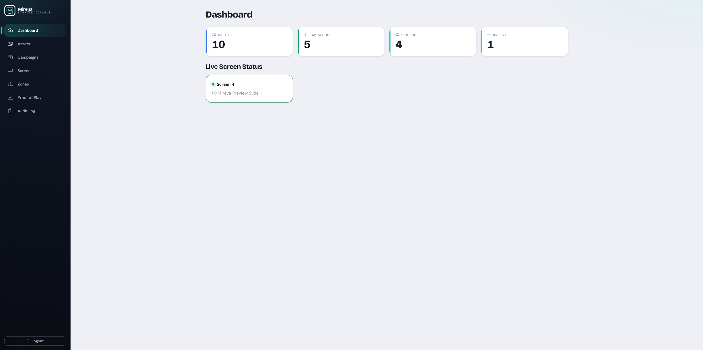

# Mireya

Mireya is an open digital-signage system for managing screens, content, schedules, and playback reporting from one web backend.

The project is in active development. The current implementation supports local development and evaluation, but still needs production hardening and packaging work before it should be treated as a finished product.

## System overview

Mireya has two main parts:

- **Backend/admin app**: an ASP.NET Core application with a Blazor Server admin UI, REST APIs, Identity authentication, OpenAPI, SignalR screen messaging, EF Core persistence, and background services.
- **Display clients**: Avalonia-based clients that run on signage devices. The shared client core is hosted by desktop and Android TV platform heads.

Administrators use the web UI to upload assets, create campaigns, approve screens, assign campaigns, review playback activity, and send remote commands to connected screens.

Display clients connect to a Mireya backend, register themselves, wait for approval, sync assigned campaign content, cache media locally, and play the active playlist. Clients reconnect automatically and can keep playing downloaded media after content has been cached.

## Current capabilities

- **Assets**: images, videos, and website URLs; upload workflow; thumbnails/poster frames; tags; search/filtering; image fit modes.
- **Campaigns**: ordered playlists, custom durations, priorities, enable/disable state, default fallback campaign, start/end dates, weekday recurrence, daily time windows, and recurrence time zones.
- **Screens**: first-run registration, pairing code, approval/rejection, online status, last-seen tracking, shuffle playback, asset sync status, and remote commands.
- **Reports**: proof-of-play records every asset start reported by a screen and aggregates plays by screen and asset over a selected time window.
- **Audit log**: mutating admin actions are recorded with actor, target, action, timestamp, and summary.
- **Offline alerting**: optional webhook notifications for screens that stay offline beyond a configured threshold, plus recovery notifications when they come back online.
- **Operations**: SQLite and PostgreSQL providers, automatic migrations on startup, Docker Compose, .NET Aspire AppHost, health endpoints, and generated API client support.

## Documentation map

- [Features](features.md): operator-facing guide to what the admin and client apps do.
- [Development](development.md): local setup, project structure, build/test commands, migrations, and client development.
- [Database ER Model](database-er-model.md): current API and client schemas, relationships, constraints, indexes, and review candidates.
- [Android Debugging](debugging/android.md): emulator/device builds, deployment, logging, and verification.
- [Operations](operations.md): configuration, Docker, Aspire, health checks, alerting, and runtime notes.
- [API](api.md): endpoint groups, auth roles, SignalR hub behavior, and generated client workflow.
- [Packaging](packaging.md): current client platform status and packaging notes.
- [Microsoft Store Release](microsoft-store-release.md): Partner Center setup, local validation, and listing content.
- [Google Play Release](google-play-release.md): Android signing, Play Console setup, and artifact submission.
