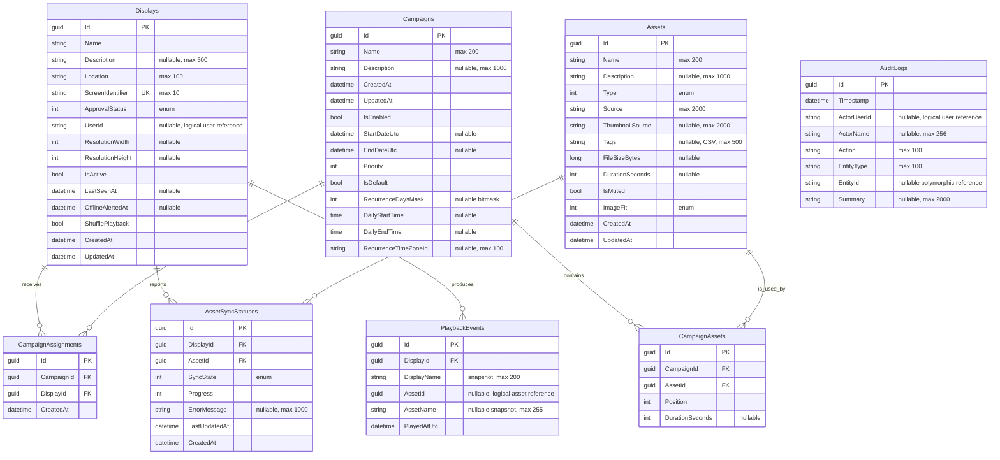
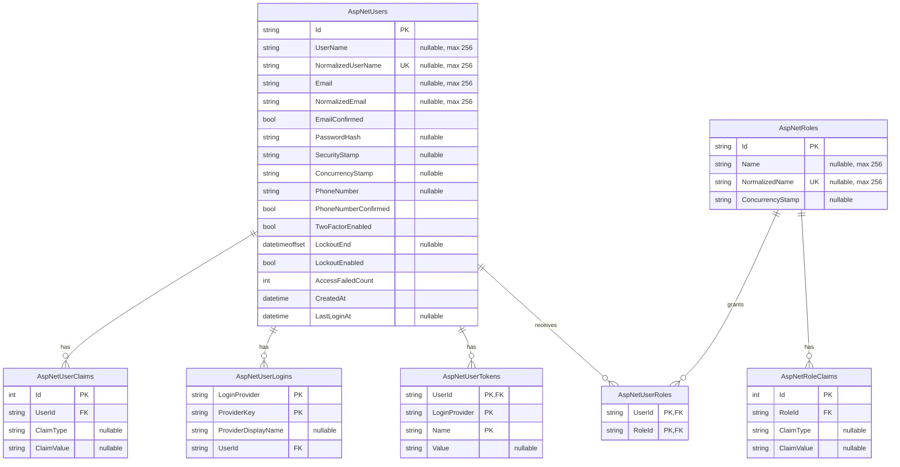

# Database entity-relationship model

This document describes the current persisted EF Core models for the Mireya API and
display client. It is intended as the starting point for a separate normalization,
integrity, query-pattern, and index review.

The diagrams are based on the current model snapshots:

- API: `Mireya.Database.Postgres/Migrations/MireyaDbContextModelSnapshot.cs` and
  `Mireya.Database.Sqlite/Migrations/MireyaDbContextModelSnapshot.cs`
- Client: `Mireya.ApiClient/Migrations/LocalDbContextModelSnapshot.cs`

The API's PostgreSQL and SQLite snapshots have the same logical schema. Their physical
column types differ, so the diagrams use provider-neutral types. `PK`, `FK`, and `UK`
mean primary key, foreign key, and single-column unique key. Nullable columns are
identified in comments. Composite keys and indexes are listed after each diagram.

## API database: signage domain

### API domain constraints and indexes

| Table | Unique constraints beyond the primary key | Non-unique indexes | Delete behavior |
| --- | --- | --- | --- |
| `Displays` | `ScreenIdentifier` | `Name`, `IsActive`, `ApprovalStatus` | Deleting a display cascades to assignments, sync statuses, and playback events |
| `Assets` | — | `Type` | Deleting an asset is restricted while campaign items reference it; sync statuses cascade |
| `Campaigns` | — | `Name`, `CreatedAt` | Deleting a campaign cascades to campaign items and assignments |
| `CampaignAssets` | (`CampaignId`, `Position`) | `CampaignId`, `AssetId` | Both foreign keys are required |
| `CampaignAssignments` | (`CampaignId`, `DisplayId`) | `CampaignId`, `DisplayId` | Both foreign keys cascade |
| `AssetSyncStatuses` | (`DisplayId`, `AssetId`) | `DisplayId`, `AssetId`, `SyncState` | Both foreign keys cascade |
| `PlaybackEvents` | — | `PlayedAtUtc`, `DisplayId`, `AssetId` | Only `DisplayId` is an enforced foreign key |
| `AuditLogs` | — | `Timestamp`, `EntityType`, `ActorUserId` | No foreign keys; historical values are snapshots/logical references |

## API database: ASP.NET Core Identity

Identity tables are separated from the domain diagram to keep both diagrams readable.
They live in the same API database.

All Identity relationships cascade on deletion. Its indexes beyond primary keys are:

| Table | Unique indexes | Non-unique indexes |
| --- | --- | --- |
| `AspNetUsers` | `NormalizedUserName` | `NormalizedEmail` |
| `AspNetRoles` | `NormalizedName` | — |
| `AspNetUserClaims` | — | `UserId` |
| `AspNetUserLogins` | — | `UserId` |
| `AspNetUserRoles` | — | `RoleId` |
| `AspNetUserTokens` | — | — |
| `AspNetRoleClaims` | — | `RoleId` |

## Client database

The client database is SQLite. It stores offline copies of server assets and campaigns,
backend-scoped mappings, credentials, download state, and local settings.

```mermaid
erDiagram
    BackendInstances ||--o| BackendCredentials : has
    BackendInstances ||--o{ BackendAssets : provides
    Assets ||--o{ BackendAssets : is_mapped_by
    BackendInstances ||--o{ BackendCampaigns : provides
    Campaigns ||--o{ BackendCampaigns : is_mapped_by
    BackendInstances ||--o{ DownloadedAssets : tracks
    Campaigns ||--o{ CampaignAssets : contains
    Assets ||--o{ CampaignAssets : is_used_by
    Campaigns ||--o{ CampaignAssignment : is_assigned_by
    Display ||--o{ CampaignAssignment : receives

    BackendInstances {
        guid Id PK
        string BaseUrl UK "max 500"
        string Name "nullable, max 200"
        bool IsCurrentBackend
        datetime LastConnectedAt
        datetime CreatedAt
    }

    BackendCredentials {
        guid BackendInstanceId PK, FK
        string Username "nullable"
        bytes EncryptedAccessToken "nullable"
        bytes EncryptedRefreshToken "nullable"
        bytes EncryptedPassword "nullable"
        datetime TokenExpiresAt "nullable"
        datetime CreatedAt
        datetime UpdatedAt
    }

    BackendAssets {
        guid BackendInstanceId PK, FK
        guid AssetId PK, FK
        datetime SyncedAt
    }

    BackendCampaigns {
        guid BackendInstanceId PK, FK
        guid CampaignId PK, FK
        datetime SyncedAt
    }

    DownloadedAssets {
        guid BackendInstanceId PK, FK
        guid AssetId PK "logical asset reference"
        string LocalPath "nullable, max 500"
        string FileExtension "nullable, max 10"
        bool IsDownloaded
        datetime DownloadedAt "nullable"
        datetime LastCheckedAt
    }

    ClientSettings {
        string Key PK "max 100"
        string Value
    }

    Assets {
        guid Id PK
        string Name "max 200"
        string Description "nullable, max 1000"
        int Type "enum"
        string Source "max 2000"
        string ThumbnailSource "nullable, max 2000"
        string Tags "nullable, CSV, max 500"
        long FileSizeBytes "nullable"
        int DurationSeconds "nullable"
        bool IsMuted
        int ImageFit "enum"
        datetime CreatedAt
        datetime UpdatedAt
    }

    Campaigns {
        guid Id PK
        string Name "max 200"
        string Description "nullable, max 1000"
        datetime CreatedAt
        datetime UpdatedAt
        bool IsEnabled
        datetime StartDateUtc "nullable"
        datetime EndDateUtc "nullable"
        int Priority
        bool IsDefault
        int RecurrenceDaysMask "nullable bitmask"
        time DailyStartTime "nullable"
        time DailyEndTime "nullable"
        string RecurrenceTimeZoneId "nullable, max 100"
    }

    CampaignAssets {
        guid Id PK
        guid CampaignId FK
        guid AssetId FK
        int Position
        int DurationSeconds "nullable"
    }

    CampaignAssignment {
        guid Id PK
        guid CampaignId FK
        guid DisplayId FK
        datetime CreatedAt
    }

    Display {
        guid Id PK
        string Name "max 200"
        string Description "nullable, max 500"
        string Location "max 100"
        string ScreenIdentifier "max 10"
        int ApprovalStatus "enum"
        string UserId "nullable"
        int ResolutionWidth "nullable"
        int ResolutionHeight "nullable"
        bool IsActive
        datetime LastSeenAt "nullable"
        datetime OfflineAlertedAt "nullable"
        bool ShufflePlayback
        datetime CreatedAt
        datetime UpdatedAt
    }
```

### Client constraints and indexes

| Table | Unique constraints beyond the primary key | Non-unique indexes | Delete behavior |
| --- | --- | --- | --- |
| `BackendInstances` | `BaseUrl` | — | Deletion cascades to credentials, backend mappings, and download records |
| `BackendCredentials` | — | — | Shared primary key is also the backend foreign key |
| `BackendAssets` | — | `AssetId` | Both foreign keys cascade |
| `BackendCampaigns` | — | `CampaignId` | Both foreign keys cascade |
| `DownloadedAssets` | — | `IsDownloaded` | Only `BackendInstanceId` is an enforced foreign key |
| `Assets` | — | `Type` | Deletion cascades to backend mappings and campaign items |
| `Campaigns` | — | `Name` | Deletion cascades to backend mappings, campaign items, and assignments |
| `CampaignAssets` | — | `CampaignId`, `AssetId`, (`CampaignId`, `Position`) | Both foreign keys cascade; campaign position is not unique on the client |
| `CampaignAssignment` | — | `CampaignId`, `DisplayId` | Both foreign keys cascade |
| `Display` | — | — | Deletion cascades to assignments |
| `ClientSettings` | — | — | No relationships |

`Display` and `CampaignAssignment` are present in the client migration snapshot even
though `LocalDbContext` does not expose them as `DbSet` properties. EF discovers them
through `Campaign.CampaignAssignments` because the client reuses the server `Campaign`
entity. They are therefore part of the physical client schema shown above.

## Provider type mapping

| Logical type | API PostgreSQL | API SQLite / client SQLite |
| --- | --- | --- |
| `guid` | `uuid` | `TEXT` |
| `datetime` | `timestamp with time zone` | `TEXT` |
| `datetimeoffset` | `timestamp with time zone` | `TEXT` |
| `time` | `time without time zone` | `TEXT` |
| `bool` | `boolean` | `INTEGER` |
| `int` | `integer` | `INTEGER` |
| `long` | `bigint` | `INTEGER` |
| `string` | `text` / `character varying(n)` | `TEXT` |
| `bytes` | `bytea` when used | `BLOB` |

## Initial optimization review candidates

These are questions raised by the structure, not recommendations to change the model
without checking real query plans, row counts, retention rules, and sync behavior.

1. **Client model scope:** determine whether `Display` and `CampaignAssignment` should
   be stored locally. If not, exclude the server navigation graph from the client model
   or use dedicated client persistence entities.
2. **Client parity:** the API enforces unique (`CampaignId`, `Position`) and unique
   (`CampaignId`, `DisplayId`) constraints, while the client does not. Decide whether
   offline data should preserve the same invariants.
3. **Logical references:** `Displays.UserId`, `AuditLogs.ActorUserId`,
   `PlaybackEvents.AssetId`, and `DownloadedAssets.AssetId` are not foreign keys.
   Some are intentionally historical or polymorphic; document that decision and check
   whether the others can accumulate orphans.
4. **Backend scoping:** client campaign items reference global `Assets` and `Campaigns`
   by GUID, not by (`BackendInstanceId`, entity ID). Confirm that every sync and cleanup
   path prevents data from different backends from being combined.
5. **Single-current/default invariants:** neither `BackendInstances.IsCurrentBackend`
   nor `Campaigns.IsDefault` is constrained to a single true row. Verify that the
   application transactionally maintains these invariants, or consider provider-specific
   filtered/partial unique indexes.
6. **Possible redundant indexes:** on the API, standalone leading-column indexes such
   as `CampaignAssets.CampaignId`, `CampaignAssignments.CampaignId`, and
   `AssetSyncStatuses.DisplayId` may overlap their composite unique indexes. Confirm with
   provider query plans before removing anything.
7. **Reporting indexes:** current playback reports filter by `PlayedAtUtc` and then group
   by display or asset, so the time index matches the leading filter. If subject-specific
   time-range filters are added, compare it with composite candidates such as
   (`DisplayId`, `PlayedAtUtc`) and (`AssetId`, `PlayedAtUtc`) using production-shaped
   queries and data volumes.
8. **Tags:** comma-separated `Assets.Tags` is simple for transport but is not relational
   and cannot efficiently support indexed tag membership. Normalize it only if tag
   filtering/selectivity and asset volume justify the extra tables and sync complexity.
