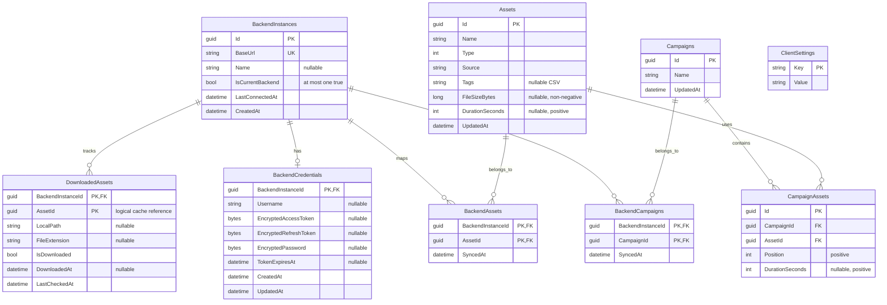

# Database model and optimization decisions

This document is the review baseline for Mireya's two databases after the database
optimization and the complete `Display` to `Screen` rename.

- The API can use PostgreSQL or SQLite. Both providers have the same logical model.
- The client uses SQLite as an offline cache.
- `PK`, `FK`, and `UK` mean primary key, foreign key, and unique key.
- Snapshot fields intentionally keep readable historical text even after referenced
  data is deleted.

## API database

```mermaid
erDiagram
    AspNetUsers ||--o| Screens : authenticates
    Screens ||--o{ CampaignAssignments : receives
    Campaigns ||--o{ CampaignAssignments : assigns
    Campaigns ||--o{ CampaignAssets : contains
    Assets ||--o{ CampaignAssets : uses
    Screens ||--o{ AssetSyncStatuses : reports
    Assets ||--o{ AssetSyncStatuses : tracks
    Screens ||--o{ PlaybackEvents : produces

    Screens {
        guid Id PK
        string Name
        string Description "nullable"
        string Location
        string ScreenIdentifier UK
        int ApprovalStatus
        string UserId FK,UK "nullable"
        int ResolutionWidth "nullable, positive"
        int ResolutionHeight "nullable, positive"
        bool IsActive
        datetime LastSeenAt "nullable"
        datetime OfflineAlertedAt "nullable"
        bool ShufflePlayback
        datetime CreatedAt
        datetime UpdatedAt
    }

    Assets {
        guid Id PK
        string Name
        string Description "nullable"
        int Type
        string Source
        string ThumbnailSource "nullable"
        string Tags "nullable CSV"
        long FileSizeBytes "nullable, non-negative"
        int DurationSeconds "nullable, positive"
        bool IsMuted
        int ImageFit
        datetime CreatedAt
        datetime UpdatedAt
    }

    Campaigns {
        guid Id PK
        string Name
        string Description "nullable"
        datetime CreatedAt
        datetime UpdatedAt
    }

    CampaignAssets {
        guid Id PK
        guid CampaignId FK
        guid AssetId FK
        int Position "positive"
        int DurationSeconds "nullable, positive"
    }

    CampaignAssignments {
        guid Id PK
        guid CampaignId FK
        guid ScreenId FK "nullable for global fallback"
        int TargetKind "screen or global fallback"
        bool IsEnabled
        datetime StartDateUtc "nullable"
        datetime EndDateUtc "nullable"
        int Priority
        int RecurrenceDaysMask "nullable, 0 to 127"
        time DailyStartTime "nullable pair"
        time DailyEndTime "nullable pair"
        string RecurrenceTimeZoneId "nullable"
        datetime CreatedAt
        datetime UpdatedAt
    }

    AssetSyncStatuses {
        guid Id PK
        guid ScreenId FK
        guid AssetId FK
        int SyncState
        int Progress "0 to 100"
        string ErrorMessage "nullable"
        datetime LastUpdatedAt
        datetime CreatedAt
    }

    PlaybackEvents {
        guid Id PK
        guid ScreenId FK
        string ScreenName "historical snapshot"
        guid AssetId "nullable logical reference"
        string AssetName "nullable snapshot"
        datetime PlayedAtUtc
    }

    AuditLogs {
        guid Id PK
        datetime Timestamp
        string ActorUserId "nullable logical reference"
        string ActorName "nullable snapshot"
        string Action
        string EntityType
        string EntityId "nullable polymorphic reference"
        string Summary "nullable"
    }

    AspNetUsers {
        string Id PK
        string UserName
        string NormalizedUserName UK
        string Email "nullable"
        datetime CreatedAt
        datetime LastLoginAt "nullable"
    }
```

The remaining ASP.NET Core Identity tables are unchanged:
`AspNetRoles`, `AspNetUserClaims`, `AspNetUserLogins`, `AspNetUserTokens`,
`AspNetUserRoles`, and `AspNetRoleClaims`.

### API integrity and index summary

| Table | Database rule | Important indexes |
| --- | --- | --- |
| `Screens` | identifier unique; user optional but linked to a real user and used by at most one screen; resolutions positive | name, created time, and `(ApprovalStatus, IsActive, CreatedAt)` |
| `Campaigns` | reusable campaign content has no target-specific playback policy | name and created time |
| `CampaignAssets` | position unique inside a campaign; positive position and duration | asset and `(CampaignId, Position)` |
| `CampaignAssignments` | one assignment per campaign/screen; exactly one global fallback at most; target and schedule fields must be valid | screen, filtered `(CampaignId, ScreenId)`, and filtered unique global-fallback target |
| `AssetSyncStatuses` | one state per screen and asset; progress from 0 to 100 | asset, state, and `(ScreenId, AssetId)` |
| `PlaybackEvents` | screen is enforced; asset is deliberately a logical reference | played time, screen, asset |
| `AuditLogs` | deliberately stores historical/logical references | time, entity type, actor |

Deleting a screen cascades to its assignments, sync states, and playback events.
Deleting an asset is blocked while a campaign still uses it. Audit data remains
independent so that history is not silently erased.

## Client database

The client database is a cache, not a second copy of the whole server database. It
therefore contains only data required for backend selection, authentication, content
synchronization, downloads, and local settings. Assignment schedules are evaluated by
the server and are not persisted in the client cache.

The old client tables `Display` and `CampaignAssignment` were accidental EF model
discoveries. The client did not use them, so the optimization migration removes them
instead of renaming them. This reduces the client schema from 11 to 9 tables.

### Client integrity and index summary

| Table | Database rule | Important indexes |
| --- | --- | --- |
| `BackendInstances` | URL unique; at most one current backend | partial unique current-backend index |
| `CampaignAssets` | position unique inside a campaign; positive position and duration | asset and `(CampaignId, Position)` |
| `Campaigns` | cached content metadata only | name |
| `Assets` | non-negative size and positive duration | type |
| `DownloadedAssets` | backend is enforced; asset remains a logical cache reference | downloaded state |

The client does not persist campaign assignments. The server sends only the campaigns
active for the connected screen while pre-caching assets for upcoming assignments.

## Decisions in simple words

| Finding | Best decision | Why |
| --- | --- | --- |
| `Display` and `Screen` were mixed | Use `Screen` everywhere in the domain, database, API contract, generated client, UI bindings, and tests | One term prevents mapping mistakes and makes the API easier to understand |
| Playback schedules were global campaign properties | Move playback policy to target-specific campaign assignments | The same reusable campaign can run on different schedules and priorities on different screens |
| Global fallback has no screen | Represent it as a global-fallback assignment with a nullable screen | Fallback scheduling follows the same rules without putting playback policy back on the campaign |
| Current client backend was application-only | Add a partial unique index and switch it transactionally | The cache cannot end up with two active backends |
| Screen-to-user link was only text | Add a real optional foreign key and a unique index | A screen cannot point to a missing user or share one login with another screen |
| Screen registration writes a user, role, and screen | Put all three writes in one transaction | A failed registration cannot leave an orphan login behind |
| Invalid ranges and negative values were possible | Add check constraints | Bad values are rejected close to the source instead of failing later in playback |
| Client campaign positions could duplicate | Match the server's unique `(CampaignId, Position)` rule | Offline ordering stays deterministic |
| Several indexes duplicated the first part of a composite index | Remove the redundant ones | Less storage and faster inserts/updates without losing query support |
| Playback and audit references can outlive their source | Keep snapshots/logical references | Reports and audit history must remain readable after content or users are removed |
| Download records can outlive cached asset metadata | Keep `DownloadedAssets.AssetId` logical | File cleanup must still work after cache metadata disappears |
| Tags are comma-separated | Keep for now; normalize into `Tags` and `AssetTags` only when tag filtering becomes important | A join table is cleaner, but currently adds sync complexity without proven benefit |
| Client entities use globally generated GUIDs across backends | Keep the existing IDs now; introduce dedicated backend-scoped client entities in a later phase if multi-backend collisions or cleanup bugs are observed | A full key redesign is high-risk and is not justified by the current access pattern |

## Migration safety

The API migration renames `Displays` to `Screens`; it does not drop and recreate the
table. Existing screen rows and child references are retained. Before stricter rules
are enabled, legacy invalid values are normalized: impossible dimensions/durations are
cleared, progress is clamped, duplicate positions are ordered deterministically, and
duplicate default/current flags keep the most recently updated row.

The rename is a breaking API contract change (`displayId`/`displayIds` become
`screenId`/`screenIds`). Server and clients should therefore be deployed as one
coordinated release.

## Provider type mapping

| Logical type | API PostgreSQL | API SQLite / client SQLite |
| --- | --- | --- |
| `guid` | `uuid` | `TEXT` |
| `datetime` | `timestamp with time zone` | `TEXT` |
| `time` | `time without time zone` | `TEXT` |
| `bool` | `boolean` | `INTEGER` |
| `int` / `long` | `integer` / `bigint` | `INTEGER` |
| `string` | `text` or `varchar(n)` | `TEXT` |
| `bytes` | `bytea` | `BLOB` |
